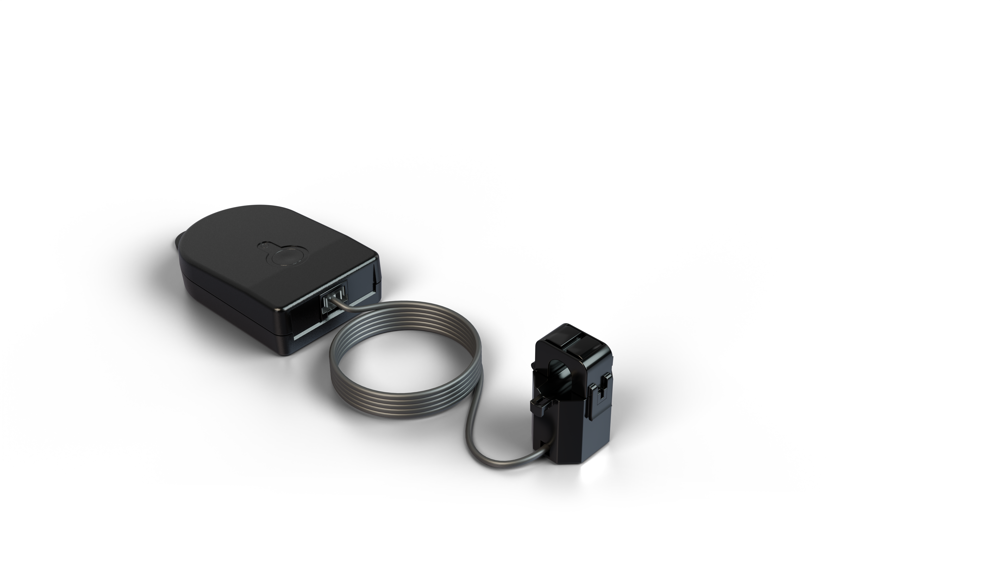

# CTLW xCH xxxA Sensor Decoder

Payload codec for **CTLW_xCH_xxxA_Lxxx** LoRaWAN messages.

|        CTLW_1CH_xxxA_Lxxx       |         CTLW_3CH_xxxA_Lxxx         |
| :-----------------------------: | :--------------------------------: |
|  |  |


## 🌐 1 - Supported Platforms

This project includes catch-all wrappers for the following network server formats:

- ChirpStack v4 / TTN v3 formatter: `decodeUplink(input)`
- ChirpStack v3 legacy: `Decode(fPort, bytes)`
- The Things Network legacy: `Decoder(bytes, port)`

## 📂 2 - Files

- `CTLW_xCH_xxxA-sensor_decoder.js`
  - Shared decode core + all platform wrapper functions.


### Data payload format

|      CHANNEL      | LENGTH | DESCRIPTION                                                          |
| :---------------: | :----: | -------------------------------------------------------------------- |
|    ch1 amps       |    2   | Channel 1 current <br/>current, unit: Ah, read: uint16 / divisor     |
|    ch2 amps       |    2   | Channel 2 current <br/>current, unit: Ah, read: uint16 / divisor     |
|    ch3 amps       |    2   | Channel 3 current <br/>current, unit: Ah, read: uint16 / divisor     |
|    counter        |    1   | Number of 30 second readings taken <br/> read: uint8                 |


## 📄 3 - Example Decoder Output Format

Example decoded object:

```json
//Device 1, fPort:60, data:AAAAABYEAQA=
{
  "ch1_amps":0,
  "ch2_amps":10.46,
  "ch3_amps":0,
  "counter":1
}
```

## 📝 4 - Notes

- Decoder includes payload-length checks to prevent invalid decoding on short payloads.
